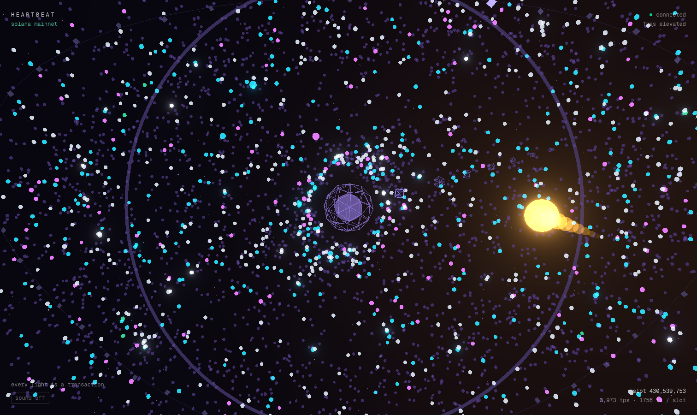

# Heartbeat

A live, full-screen 3D visualization of Solana. Every light is a real
transaction: votes fall as ambient dust, transfers and swaps stream in as
colored particles, and whale transfers arrive as golden comets that spiral
into the core, shake the camera, and land with a synthesized sub-bass thump.
Every ~400ms a slot closes — the accumulated energy collapses inward, the
core flashes, a shockwave rolls out, and a block is ejected into a receding
chain of recent blocks. A constellation of validator nodes circles the
field; each slot, the leader (picked deterministically from the real slot
number, so every viewer sees the same one) lights up. There are no tables
and no charts; the scene is the interface, and the numbers exist only as
dim monospace annotations in the corners.



## Architecture

```
 Solana mainnet
      │  one websocket (Helius if HELIUS_API_KEY, else SOLANA_WS_URL,
      │  default PublicNode — free blockSubscribe, keyless live mode):
      │    1. blockSubscribe            (native 400ms push)
      │    2. else slotSubscribe ticks → HTTP getBlock polling, 3-way
      │       concurrent, in-order      (any RPC with getBlock)
      │    3. else slots-only           (degraded, badge shown)
      ▼
┌─────────────────┐   parse each block once: classify by program ID,
│  server/        │   count votes, extract lamports, flag whales,
│  Node 20 + ws   │   stride-sample the rest to ≤150 txs/slot
└─────────────────┘
      │  compact JSON, ~1.8 KB per slot, fan-out to N clients
      │  (votes only ever travel as a per-slot count)
      ▼
┌─────────────────┐   lib/feedSource.ts adapts the wire protocol into
│  Next.js app    │   FeedTx/SlotSummary; if the feed is missing, down,
│  R3F + bloom    │   or slots-only, the synthetic feed takes over
└─────────────────┘   automatically (badge shown, never a black screen)
```

Feed modes, all verified end to end:

| mode | what's real | when |
|---|---|---|
| `live` | everything | default: keyless via PublicNode (~1min lag) or Helius key (~3s lag) |
| `hybrid` | slot numbers + cadence | RPC that serves neither blocks nor `getBlock` |
| `synthetic` | nothing (realistic mix) | no feed URL, feed down, or WebGL-less poster |

## Running locally

Node 20 (`.nvmrc`). Two processes, both optional beyond the first:

```sh
npm install && npm run dev        # web app — synthetic feed, zero config
```

To feed it real chain data — no key needed (PublicNode serves
`blockSubscribe` for free; the stream runs ~1min behind the chain head
and auto-resubscribes if it drifts past ~2min):

```sh
cd server && npm install && cd ..
npm run dev:ingest                # keyless full live mode
echo 'NEXT_PUBLIC_FEED_URL=ws://localhost:8787' > .env.local
npm run dev
```

A [Helius](https://helius.dev) key trades the ~1min lag for ~3s (their
free tier lacks `blockSubscribe`, so the ingest polls `getBlock` at ~0.9s
cadence / ~52% slot coverage; each block costs one API credit, worth
knowing before leaving it running for days):

```sh
echo 'HELIUS_API_KEY=<key>' > server/.env   # gitignored, server-side only
npm run dev:ingest
```

Server env (all optional): `HELIUS_API_KEY`, `SOLANA_WS_URL`, `PORT` (8787),
`WHALE_SOL` (1000), `MAX_TXS_PER_SLOT` (150). No keys ever reach the client;
the only `NEXT_PUBLIC_` var is the feed URL.

## Measured numbers

Real measurements, not aspirations. Setup: M-series MacBook, production
build (`next build && next start`), Chrome 1512×900.

- **60.1 fps** sustained on the live mainnet feed (rAF-measured over 10s
  after warmup, bloom + additive blending on, everything rendering).
  Adaptive governor steps down 4000→2500→1500 particles, then bloom off,
  then DPR 1.0 if a machine can't hold 48 fps; hidden tabs pause
  rendering entirely.
- **~4,300 instances + 1,500 star points in 9 draw calls**: particle pool
  4,000 + whale pool 264 (24 whales × head+10-ghost trail) + 8-block
  chain + 48-node validator ring, one `InstancedMesh` each, plus core,
  ember, shockwave, starfield, and the validator loop. Zero allocations
  in any `useFrame` loop — flat preallocated `Float32Array`s, one reused
  dummy.
- **2.0 KB/s per client measured live** over 30s of real mainnet flow
  (free-key polling mode; ≤2 KB slot messages, 4 real whales in that
  window). A representative block — slot 430,532,682, 1,171 txs, 3.43 MB
  upstream JSON — aggregates to **1,762 bytes**, a ~1,950× reduction.
  Slots-only mode is ~70 B per slot.
- **100% block coverage keyless** via PublicNode `blockSubscribe`
  (measured: 26/26 slots over 20s, monotonic, 2.2 KB/s, 4 whales),
  running ~165 slots (~1min) behind head — the lag plateaus, and the
  ingest resubscribes if it ever passes ~2min. Helius polling mode
  instead: ~3s behind, ~52% coverage, ~0.87s cadence.
- **~11 ms per slot** of server CPU against that same real block:
  10.1 ms `JSON.parse` + 0.89 ms classify/aggregate — ~2.7% of one core
  at mainnet's 400ms cadence.
- **568 KB transferred** for the whole page (10 requests, prod build).
- Classification of a real block: 701 votes / 172 transfers / 71 swaps /
  7 NFT / 220 other — votes are ~60% of mainnet, which is why they only
  ever travel as a count.

## Deploying

- **Web** — Vercel: import the repo, set `NEXT_PUBLIC_FEED_URL=wss://…`,
  done (`vercel.json` included). Without the env var the site runs
  synthetic — infra can die without the demo dying.
- **Ingest** — Fly.io: `server/Dockerfile` + `server/fly.toml` are ready;
  `fly launch --copy-config --no-deploy && fly secrets set
  HELIUS_API_KEY=… && fly deploy` from `server/`. One always-on machine
  holds the single upstream subscription for all viewers.

## Non-goals

No historical replay, no click-to-explorer, no wallet connection, no
multi-chain. One live view, done properly.
